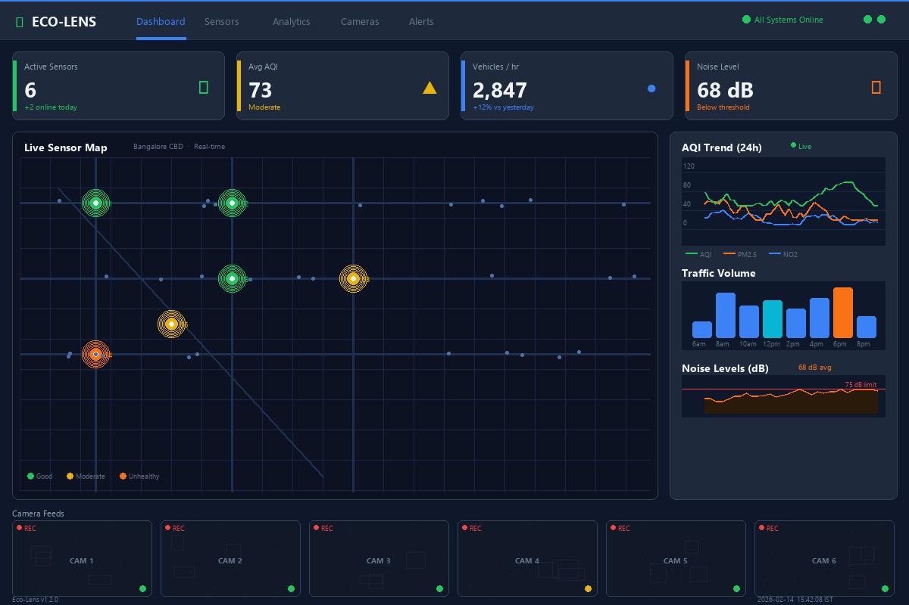
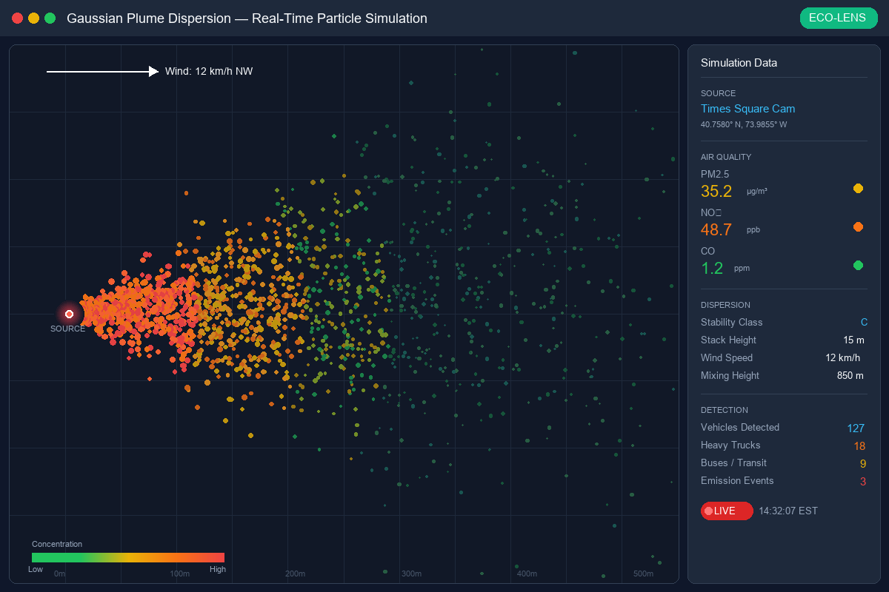
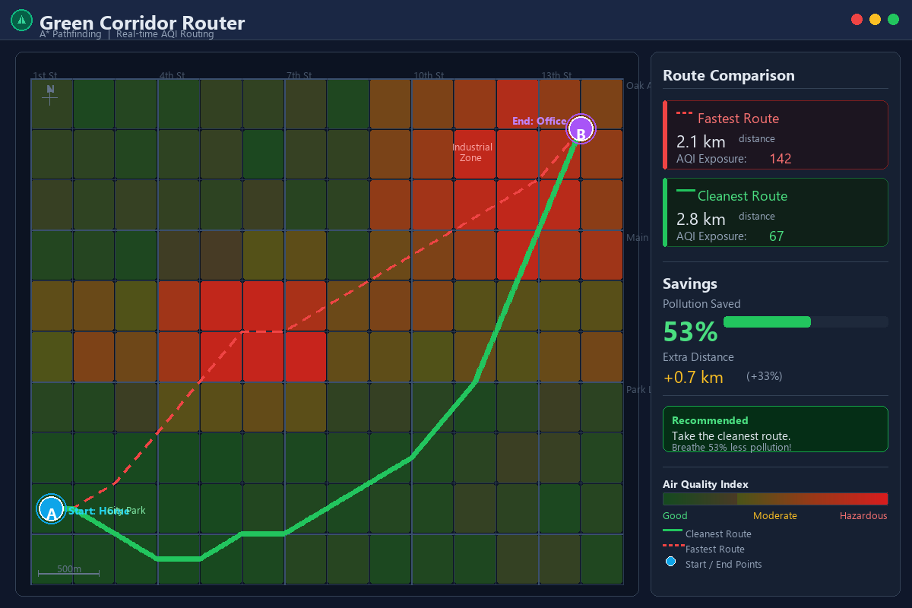

<p align="center">
  
</p>

<h1 align="center">ECO-LENS: Virtual Air Quality Matrix</h1>

<p align="center">
  <strong>Turning Traffic Cameras into Virtual Air Quality Sensors</strong>
</p>

<p align="center">
  
  
  
  
  
  
</p>

<p align="center">
  
  <a href="https://github.com/divyamohan1993/hacksagon/actions"></a>
</p>

---

## The Problem

**4.2 million people die annually** from outdoor air pollution (WHO, 2023). Yet most cities have fewer than 10 fixed air quality monitors covering hundreds of square kilometers. Communities living near busy roads -- often low-income and minority neighborhoods -- breathe air that is **2-3x more polluted** than what the nearest monitoring station reports.

Hardware sensors cost **$15,000-$50,000 each** and take months to deploy. Meanwhile, there are **over 1 million traffic cameras** already installed across US cities, sitting idle between traffic incidents.

**What if every traffic camera was also an air quality sensor?**

ECO-LENS transforms existing traffic camera infrastructure into a dense virtual air quality monitoring network. By counting and classifying vehicles with computer vision, applying EPA-certified emission factors, and modeling atmospheric dispersion with Gaussian plume equations, we generate **hyper-local, real-time air quality estimates** at a fraction of the cost of physical sensors.

---

## Architecture

```
 TRAFFIC CAMERAS          BACKEND (FastAPI)                    FRONTEND (Next.js)
 +--------------+    +---------------------------+    +---------------------------+
 | Camera Feed  |--->| YOLOv8 Vehicle Detection  |    |   Interactive Map (Deck.gl)|
 | (RTSP/MJPEG) |    |   - Car, Truck, Bus,      |    |   - Heatmap Layer          |
 +--------------+    |     Motorcycle counting    |    |   - Particle Animation     |
        |            +-------------+---------------+    |   - Sensor Mesh Grid       |
        v                         |                    |   - Green Corridors        |
 +--------------+                 v                    +---------------------------+
 | Simulation   |    +---------------------------+              ^
 | Mode (Demo)  |--->| EPA Emission Calculator   |              |
 +--------------+    |   - AP-42 Factors (g/s)   |    +---------------------------+
                     |   - Vehicle class lookup   |    |   Real-time Dashboard      |
 +--------------+    +-------------+---------------+    |   - AQI Gauge              |
 | OpenWeather  |                 |                    |   - Cigarette Equivalents  |
 | Map API      |----+            v                    |   - Noise Level Meter      |
 | (Wind, Temp) |    | +---------------------------+   |   - Historical Charts      |
 +--------------+    | | Gaussian Plume Dispersion |   +---------------------------+
                     | |   - Pasquill-Gifford      |              ^
                     +>|   - Wind transport         |              |
                       |   - Atmospheric stability  |    +---------------------------+
                       +-------------+---------------+    |   WebSocket (Live Data)    |
                                     |                    |   - 5s update interval     |
                                     v                    |   - JSON streaming         |
                       +---------------------------+      +---------------------------+
                       | Kriging Interpolation     |              ^
                       |   - Virtual sensor mesh   |              |
                       |   - Spatial estimation    |--------------+
                       +---------------------------+
                                     |
                                     v
                       +---------------------------+
                       | Health Impact Engine      |
                       |   - WHO dose-response     |
                       |   - Cigarette equivalents |
                       |   - Noise co-estimation   |
                       +---------------------------+
                                     |
                                     v
                       +---------------------------+
                       | Green Corridor Router     |
                       |   - Pollution-weighted A* |
                       |   - Minimal exposure path |
                       +---------------------------+
```

---

## 5 Unique Features

### 1. Kriging-Interpolated Virtual Sensor Mesh

Traditional air quality maps show data from sparse, fixed monitoring stations. ECO-LENS uses **Ordinary Kriging** (a geostatistical interpolation technique) to generate a continuous, high-resolution pollution surface from discrete camera-based estimates.

- Creates a dense **virtual sensor grid** across the monitored area
- Applies variogram modeling to capture spatial correlation of pollutant concentrations
- Provides uncertainty estimates at every grid point
- Updates in real-time as traffic conditions change

> **Result:** A 50x50 virtual sensor mesh from just 3-5 camera feeds, with statistically rigorous confidence intervals.

### 2. Exposure Dosimetry with Equivalent Cigarettes Metric

Raw PM2.5 numbers (micrograms per cubic meter) are meaningless to most people. ECO-LENS converts air quality data into an intuitive, visceral metric: **cigarette equivalents**.

- Based on the Berkeley Earth study: **22 ug/m3 PM2.5 over 24 hours = 1 cigarette**
- Calculates real-time dose based on exposure duration and concentration
- Applies WHO dose-response relative risk factors for mortality, respiratory, and cardiovascular outcomes
- Displays as an animated cigarette counter on the dashboard

> **Result:** "You've breathed the equivalent of 0.3 cigarettes in the last hour" -- a message anyone can understand.

### 3. Acoustic Pollution Co-estimation (FHWA TNM)

Air pollution and noise pollution share the same source: vehicles. ECO-LENS estimates both simultaneously using the **FHWA Traffic Noise Model (TNM)** methodology.

- Calculates reference sound levels per vehicle class (67-84 dBA at 15m)
- Applies logarithmic distance attenuation
- Aggregates across all detected vehicles using energy-sum method
- Maps results against WHO Environmental Noise Guidelines (Lden 53 dBA, Lnight 45 dBA)

> **Result:** A unified pollution dashboard showing both air quality AND noise levels from a single camera feed.

### 4. Real-time Gaussian Plume Particle Simulation

ECO-LENS doesn't just calculate numbers -- it **visualizes pollution dispersal** as an animated particle system on the map, driven by real physics.

- Implements the **Gaussian plume dispersion model** with Pasquill-Gifford stability classes (A-F)
- Ingests real-time wind speed and direction from OpenWeatherMap
- Simulates thousands of particles following the concentration field
- Color-codes particles by PM2.5 concentration (green to red gradient)

> **Result:** Watch pollution plumes drift downwind from busy intersections in real-time, making the invisible visible.

### 5. Pollution-Weighted A* Green Corridor Routing

Standard navigation apps optimize for time or distance. ECO-LENS offers **Green Corridor Routing** that minimizes your total pollution exposure along a path.

- Builds a weighted graph from the Kriging-interpolated pollution surface
- Applies a modified **A* pathfinding algorithm** where edge weights = distance x PM2.5 concentration
- Finds the route that minimizes cumulative inhaled dose (not just distance)
- Compares "fastest route" vs "cleanest route" with exposure savings percentage

> **Result:** "The green route is 2 minutes longer but reduces your PM2.5 exposure by 40%."

---

## Tech Stack

| Layer | Technology | Purpose |
|-------|-----------|---------|
| **Frontend** | Next.js 16 + React 18 | Server-side rendering, app router |
| **Visualization** | Leaflet + React-Leaflet | Interactive map with heatmap overlays |
| **Backend** | FastAPI + Python 3.11 | Async API with auto-generated docs |
| **Real-time** | WebSockets | Sub-second data streaming |
| **Computer Vision** | YOLOv8 (Ultralytics) | Vehicle detection & classification |
| **Scientific** | NumPy + SciPy | Gaussian plume, Kriging, statistics |
| **Database** | SQLite / PostgreSQL | Time-series pollution data |
| **Weather Data** | OpenWeatherMap API | Wind speed, direction, temperature |
| **Containerization** | Docker + Docker Compose | One-command deployment |
| **Emission Factors** | EPA AP-42, Chapter 13 | Peer-reviewed emission rates |

---

## Quick Start

### Prerequisites

- Python 3.11+
- Node.js 18+
- An OpenWeatherMap API key ([get one free](https://openweathermap.org/api))

### Option 1: Automated Setup

**Linux / macOS:**
```bash
git clone https://github.com/divyamohan1993/hacksagon.git
cd hacksagon
chmod +x autoconfig.sh
./autoconfig.sh
```

**Windows:**
```cmd
git clone https://github.com/divyamohan1993/hacksagon.git
cd hacksagon
autoconfig.bat
```

### Option 2: Docker (Recommended for Demo)

```bash
git clone https://github.com/divyamohan1993/hacksagon.git
cd hacksagon
cp .env.example .env
# Edit .env with your OpenWeatherMap API key
docker compose up --build
```

### Option 3: Manual Setup

```bash
# 1. Clone the repository
git clone https://github.com/divyamohan1993/hacksagon.git
cd hacksagon

# 2. Configure environment
cp .env.example .env
# Edit .env with your OpenWeatherMap API key

# 3. Backend setup
cd backend
python -m venv venv
source venv/bin/activate        # Linux/Mac
# venv\Scripts\activate.bat     # Windows
pip install -r requirements.txt

# 4. Start the backend
python -m uvicorn main:app --reload --port 40881

# 5. Frontend setup (new terminal)
cd frontend
npm install
npm run dev
```

### Access the Application

| Service | URL |
|---------|-----|
| Dashboard | [http://localhost:40882](http://localhost:40882) |
| API Documentation | [http://localhost:40881/docs](http://localhost:40881/docs) |
| WebSocket Feed | [ws://localhost:40881/ws](ws://localhost:40881/ws) |
| Health Check | [http://localhost:40881/api/health](http://localhost:40881/api/health) |

---

## API Documentation

### REST Endpoints

| Method | Endpoint | Description |
|--------|----------|-------------|
| `GET` | `/api/health` | Service health check |
| `GET` | `/api/sensors` | All sensors with current readings |
| `GET` | `/api/sensors/{id}` | Single sensor data |
| `GET` | `/api/sensors/{id}/history?hours=24` | Historical readings (1-168 hours) |
| `GET` | `/api/forecast/{sensor_id}` | 6-hour PM2.5 forecast (Holt-Winters) |
| `GET` | `/api/grid` | Kriging-interpolated pollution grid |
| `GET` | `/api/stats` | Global statistics across all sensors |
| `GET` | `/api/health-impact` | Health impact summary with cigarette equivalents |
| `GET` | `/api/routing/green-path` | Pollution-minimized route (`from_lat`, `from_lng`, `to_lat`, `to_lng`) |

### WebSocket

| Endpoint | Description |
|----------|-------------|
| `ws://localhost:40881/ws` | Real-time sensor data stream (5s interval) |

**WebSocket message format:**

```json
{
  "type": "sensor_update",
  "timestamp": "2026-02-14T15:30:00Z",
  "sensors": [
    {
      "id": "cam-001",
      "name": "India Gate",
      "lat": 28.6129,
      "lng": 77.2295,
      "status": "active",
      "vehicles": { "trucks": 5, "cars": 40, "buses": 8, "motorcycles": 15, "total": 68 },
      "pollution": { "pm25": 45.2, "pm10": 68.3, "no2": 12.1, "co": 0.8, "aqi": 124, "category": "Unhealthy (Sensitive)" },
      "weather": { "wind_speed": 3.6, "wind_direction": 280, "temperature": 25.1, "humidity": 33 },
      "noise": { "db_level": 72.4, "category": "Loud" },
      "health": { "score": 65, "risk_level": "Moderate", "equivalent_cigarettes": 0.08, "vulnerable_advisory": "..." }
    }
  ],
  "grid": { "bounds": {}, "resolution": 50, "values": [[]] },
  "stats": { "active_sensors": 6, "avg_aqi": 130, "avg_pm25": 48.5 },
  "particles": [],
  "forecast": []
}
```

---

## Scientific Basis

ECO-LENS is built on peer-reviewed scientific methods and regulatory-grade emission factors:

### EPA AP-42 Emission Factors (Chapter 13)

The emission rates used in ECO-LENS are derived from the EPA's **AP-42: Compilation of Air Pollutant Emission Factors**, the gold standard for emission estimation in the United States. Vehicle-class-specific rates for PM2.5, PM10, NOx, CO, CO2, VOC, and SO2 are applied based on real-time vehicle classification.

### Gaussian Plume Dispersion Model

Pollutant transport is modeled using the **Gaussian plume equation** with **Pasquill-Gifford stability classifications** (classes A through F). This is the same model framework used by the EPA's AERMOD and SCREEN3 regulatory dispersion models.

### WHO Air Quality Guidelines (2021)

Health impact calculations reference the **WHO Global Air Quality Guidelines** (2021 update), which recommend annual mean PM2.5 below 5 ug/m3 and 24-hour mean below 15 ug/m3.

### Dose-Response Relationships

Relative risk factors for mortality and morbidity are drawn from the **Global Burden of Disease** study and integrated WHO systematic reviews:
- All-cause mortality: RR 1.06 per 10 ug/m3 PM2.5
- Respiratory disease: RR 1.10 per 10 ug/m3 PM2.5
- Cardiovascular disease: RR 1.08 per 10 ug/m3 PM2.5

### FHWA Traffic Noise Model

Noise estimation follows the methodology of the **Federal Highway Administration Traffic Noise Model (TNM)**, using reference sound emission levels per vehicle class and logarithmic distance attenuation.

### Cigarette Equivalence

The cigarette equivalence metric is based on research from **Berkeley Earth** (R. Muller, 2015), establishing that breathing air with 22 ug/m3 PM2.5 for 24 hours delivers a particulate dose equivalent to smoking one cigarette.

---

## Screenshots

<p align="center">
  <em>Screenshots will be added after the demo is deployed.</em>
</p>

| View | Description |
|------|-------------|
|  | Main dashboard with real-time AQI, traffic counts, and health metrics |
|  | Kriging-interpolated air quality heatmap overlay |
|  | Gaussian plume particle simulation with wind transport |
|  | Green corridor route comparison (fastest vs. cleanest) |
|  | Acoustic pollution co-estimation view |

---

## Project Structure

```
hacksagon/
├── backend/
│   ├── api/                            # REST + WebSocket handlers
│   ├── services/                       # 8 scientific engine modules
│   ├── tests/                          # pytest test suite
│   ├── data/                           # EPA AP-42 emission factors
│   ├── main.py                         # FastAPI application entry
│   ├── models.py                       # Pydantic data models
│   ├── config.py                       # Settings management
│   ├── database.py                     # Async SQLAlchemy layer
│   ├── requirements.txt                # Python dependencies
│   └── Dockerfile                      # Backend container
├── frontend/
│   ├── src/
│   │   ├── app/                        # Next.js app router
│   │   ├── components/                 # 11 React dashboard components
│   │   ├── hooks/                      # WebSocket hook
│   │   ├── lib/                        # API client & constants
│   │   └── types/                      # TypeScript interfaces
│   ├── package.json                    # Node dependencies
│   └── Dockerfile                      # Frontend container (multi-stage)
├── docs/                               # Documentation & presentation
├── .github/                            # CI/CD, issue & PR templates
├── docker-compose.yml                  # Multi-service orchestration
├── .env.example                        # Environment template (no secrets)
├── SECURITY.md                         # Security policy
├── autoconfig.sh                       # Linux/Mac setup with key rotation
├── autoconfig.bat                      # Windows setup with key rotation
└── README.md                           # This file
```

---

## License

This project is licensed under the **MIT License**.

```
MIT License

Copyright (c) 2025-2026 ECO-LENS Team

Permission is hereby granted, free of charge, to any person obtaining a copy
of this software and associated documentation files (the "Software"), to deal
in the Software without restriction, including without limitation the rights
to use, copy, modify, merge, publish, distribute, sublicense, and/or sell
copies of the Software, and to permit persons to whom the Software is
furnished to do so, subject to the following conditions:

The above copyright notice and this permission notice shall be included in all
copies or substantial portions of the Software.

THE SOFTWARE IS PROVIDED "AS IS", WITHOUT WARRANTY OF ANY KIND, EXPRESS OR
IMPLIED, INCLUDING BUT NOT LIMITED TO THE WARRANTIES OF MERCHANTABILITY,
FITNESS FOR A PARTICULAR PURPOSE AND NONINFRINGEMENT. IN NO EVENT SHALL THE
AUTHORS OR COPYRIGHT HOLDERS BE LIABLE FOR ANY CLAIM, DAMAGES OR OTHER
LIABILITY, WHETHER IN AN ACTION OF CONTRACT, TORT OR OTHERWISE, ARISING FROM,
OUT OF OR IN CONNECTION WITH THE SOFTWARE OR THE USE OR OTHER DEALINGS IN THE
SOFTWARE.
```

---

<p align="center">
  Built with purpose at <strong>Hacksagon 2026</strong>
  <br/>
  <em>Because the air you breathe shouldn't be a mystery.</em>
</p>
