# System Flowcharts

## 1. High-Level System Architecture

---

## 2. Data Processing Pipeline

---

## 3. Gaussian Plume Dispersion Model

```mermaid
flowchart TB
    subgraph Inputs
        Q["Emission Rate Q (g/s)<br/>= Trucks×0.070 + Cars×0.005<br/>+ Buses×0.055 + Motos×0.008"]
        U["Wind Speed u (m/s)<br/>from OpenWeatherMap"]
        STAB["Stability Class (A-F)<br/>from Wind Speed"]
    end

    subgraph Pasquill_Gifford["Pasquill-Gifford Coefficients"]
        SY["σy = a × x^0.894<br/>(Crosswind Dispersion)"]
        SZ["σz = c × x^d<br/>(Vertical Dispersion)"]
    end

    subgraph Equation["Gaussian Plume Equation"]
        FORMULA["C(x,y,z) = Q/(2π·u·σy·σz)<br/>× exp(-y²/2σy²)<br/>× [exp(-(z-H)²/2σz²)<br/>  + exp(-(z+H)²/2σz²)]"]
    end

    subgraph Output
        CONC["Concentration C<br/>(μg/m³ at receptor)"]
        AQI["AQI Score<br/>(0 - 500)"]
    end

    Q --> FORMULA
    U --> FORMULA
    STAB --> SY
    STAB --> SZ
    SY --> FORMULA
    SZ --> FORMULA
    FORMULA --> CONC
    CONC --> AQI
```

---

## 4. Real-Time WebSocket Communication Flow

---

## 5. Green Corridor Routing Algorithm

---

## 6. Kriging Spatial Interpolation Flow

```mermaid
flowchart LR
    A["6 Discrete Sensor<br/>Readings"] --> B["Calculate<br/>Semivariogram<br/>γ(h)"]
    B --> C["Fit Spherical<br/>Variogram Model<br/>γ(h) = c₀ + c₁[1.5(h/a) - 0.5(h/a)³]"]
    C --> D["Build Kriging<br/>System Matrix<br/>[Γ]{λ} = {γ₀}"]
    D --> E["Solve for<br/>Kriging Weights λᵢ"]
    E --> F["Interpolate at<br/>25×25 Grid Points<br/>Ẑ = Σλᵢ·Z(xᵢ)"]
    F --> G["Continuous Pollution<br/>Surface (Heatmap)"]

    style A fill:#1e2538,stroke:#3b82f6,color:#f0f4f8
    style G fill:#1e2538,stroke:#00d68f,color:#f0f4f8
```

---

## 7. Health Impact Dosimetry Flow

